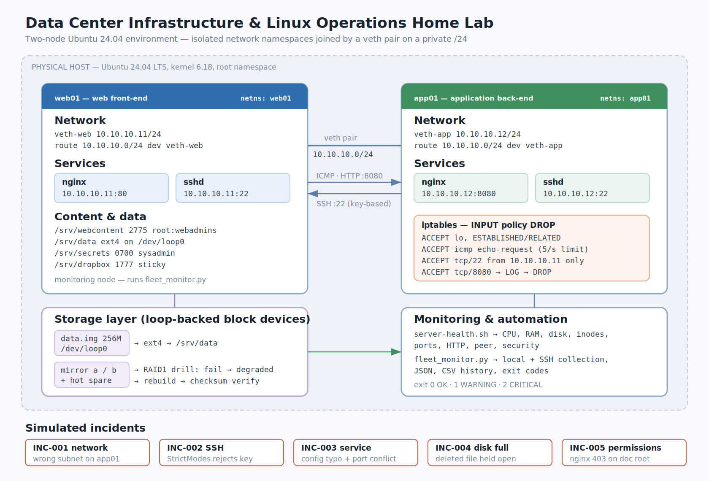

# Data Center Infrastructure & Linux Operations Home Lab

A **hands-on Linux lab**, not a production environment. It builds a two-node
infrastructure using isolated network namespaces and virtual Ethernet interfaces,
configures the services a data center technician works with daily, and then
deliberately breaks it five times to practise structured troubleshooting.

Every command output in `evidence/` is real capture from a live Ubuntu 24.04
host. Nothing is retyped or invented. Where the environment could not support
something — systemd, kernel RAID — the limitation is verified, captured, and the
real procedure documented as a runbook rather than simulated away.

---

## Why this is relevant to Data Center / Infrastructure Technician work

The daily work of a data center or infrastructure technician is largely: bring
nodes up with correct addressing, keep services running, manage access and
permissions, watch capacity, replace failed storage, and diagnose problems under
time pressure. This lab exercises each of those directly and documents the
results the way a ticket queue would expect — symptom, investigation, root cause,
resolution, validation, prevention.

The five incidents are the core of it. Three of them involved more than one
fault, which is the realistic case: fixing the first only reveals the next.

---

## Architecture



Two logical nodes, **web01** and **app01**, built as isolated Linux network
namespaces joined by a veth pair. Each has a separate IP stack, routing table,
ARP state, firewall ruleset and set of listening services.

| | web01 | app01 |
|---|---|---|
| Role | web front-end, monitoring node | application back-end |
| Address | `10.10.10.11/24` (static) | `10.10.10.12/24` (static) |
| Web | nginx `:80`, doc root `/srv/webcontent` | nginx `:8080`, doc root `/srv/appcontent` |
| SSH | sshd `:22` | sshd `:22`, key-based access from web01 |
| Storage | ext4 on a loop device at `/srv/data`; mirror pair plus hot spare | — |
| Firewall | — | iptables `INPUT` policy `DROP` with an explicit allow-list |

These are logical nodes on one host — **not two physical servers and not two
independent virtual machines**. Namespaces isolate the network stack; the kernel,
process table and filesystem are shared. Details and constraints in
[`architecture/architecture.md`](architecture/architecture.md).

## Technologies used

Ubuntu 24.04 · network namespaces and veth · iproute2 (`ip`, `ss`) · nginx ·
OpenSSH · iptables · ext4 and loop devices · POSIX ACLs · `mdadm` (documented) ·
systemd (documented) · Bash · Python 3

## Major tasks completed

- Built two isolated nodes with static private IPv4 addressing and verified
  connectivity in both directions
- Configured and validated per-node nginx and sshd, including hardening
  (`PermitRootLogin no`, `AllowGroups`, key-only automation)
- Created a user, group and permission model using SGID, sticky bit, POSIX ACLs
  and sudo policy, and proved each control by test
- Applied a default-deny firewall on app01 and verified allowed and dropped
  traffic behaved as intended
- Provisioned and monitored an ext4 data volume, tracking both capacity and inodes
- Simulated the RAID1 operational lifecycle on loop-backed storage and documented
  the equivalent `mdadm` procedures
- Wrote a Bash health checker and a Python fleet monitor that collects the remote
  node over SSH
- Simulated, diagnosed and resolved five infrastructure incidents, with reports

## Incidents simulated

| ID | Scenario | Root cause | Key lesson |
|---|---|---|---|
| [INC-001](incidents/INC-001-network-outage.md) | app01 unreachable | interface on the wrong subnet | An `INCOMPLETE` ARP entry proves nobody owns that IP. Sockets stayed `LISTEN` on an address the host no longer held — local socket state is not reachability |
| [INC-002](incidents/INC-002-ssh-failure.md) | SSH key rejected | `~/.ssh` restored `0777`; `StrictModes` refused it | Separate transport from auth first. The client knows *that* it failed; the server log says *why* |
| [INC-003](incidents/INC-003-nginx-outage.md) | nginx would not start | config typo + rogue process on `:80` + missing doc root | Validate before restarting; prefer `reload`, which never releases the socket |
| [INC-004](incidents/INC-004-disk-full.md) | volume 100% full | deleted log still held open by a running process | `du` said 36K, `df` said 121M. Reclaimed via `/proc/<pid>/fd` with no restart |
| [INC-005](incidents/INC-005-permissions-403.md) | HTTP 403 on every page | doc root `0700`; workers run as `www-data` | 403 ≠ outage. The error names the file, but a parent directory was the block. `chmod 777` is not a fix |

## Skills demonstrated

Linux administration · TCP/IP networking · SSH · Nginx and service management ·
systemd troubleshooting · Linux permissions · firewall fundamentals ·
storage and filesystem monitoring · RAID concepts and simulation ·
Bash automation · Python monitoring · incident troubleshooting ·
technical documentation

---

# Technical documentation

## Repository layout

```
data-center-infrastructure-linux-lab/
├── README.md
├── PROJECT-STATUS.md              scope, completion state, remaining work
├── architecture/                  diagram + architecture notes
├── networking/                    addressing, routing, firewall
├── linux/                         users and permissions, SSH, service management
├── storage/                       volume management, RAID1 simulation
├── monitoring/                    health-check.sh, fleet-monitor.py
├── incidents/                     INC-001 … INC-005 reports
├── runbooks/                      systemd, RAID1/mdadm, troubleshooting cheatsheet
├── scripts/                       build script, capture scripts, incident scripts
├── configs/                       nginx.conf and sshd_config per node
├── evidence/                      captured command output
└── screenshots/                   terminal images rendered from the evidence
```

## Running it

Requires a Linux host with root, `iproute2`, `nginx`, `openssh-server`,
`iptables` and loop device support.

```bash
export LAB_ROOT=~/data-center-lab          # default if unset
sudo -E bash scripts/lab-build.sh          # build (idempotent)
sudo -E bash scripts/lab-build.sh --destroy

# health of one node
sudo ip netns exec web01 bash monitoring/health-check.sh \
     -p 10.10.10.12 -l "80 22" -u "http://10.10.10.11/health"

# whole fleet, app01 collected over SSH
sudo ip netns exec web01 su sysadmin -c "python3 monitoring/fleet-monitor.py"

# replay any incident end to end
sudo bash scripts/incident-04-diskfull.sh
```

The build script was validated by necessity: the lab host was reset mid-project
and the entire environment was rebuilt from it in a single run
(`evidence/00-lab-build.log`).

## Monitoring tools

**`monitoring/health-check.sh`** — single-pass health check exiting `0` OK,
`1` WARNING, `2` CRITICAL so it drops into cron, a systemd timer or a monitoring
agent. Checks load average against core count, CPU utilisation sampled from
`/proc/stat`, memory and swap, per-filesystem capacity **and inodes**, unexpected
read-only mounts, service processes, required TCP listeners, HTTP endpoint
status, peer reachability, and security spot checks (empty passwords, non-root
UID-0 accounts, world-writable files under `/etc`). `-j` emits JSON.

**`monitoring/fleet-monitor.py`** — runs the health check locally on web01 and
over SSH on app01, aggregates both into one dashboard, appends a CSV history row
per check, and exits with the worst status across the fleet. A node that cannot
be collected reports `UNKNOWN` rather than disappearing silently.

> The port and HTTP checks exist because of a real defect found during INC-003:
> the first version tested services with `pgrep -x nginx` and reported **OK
> during a genuine outage**, because the nodes share a PID namespace and `pgrep`
> matched the other node's process. Both the false OK and the corrected CRITICAL
> are preserved in `evidence/inc-03-service.txt`.

## Documented limitations

**Nodes are namespaces, not virtual machines.** Network isolation is real;
kernel, PID namespace and filesystem are shared. The visible consequence is the
`pgrep` defect above.

**systemd is offline** on the lab host (PID 1 is not systemd), so `systemctl` and
`journalctl` cannot operate. The real errors are captured in
`evidence/05-systemd-check.txt`; service control used equivalent commands, each
annotated with its systemd counterpart, and the full procedure is in
[`runbooks/systemd-runbook.md`](runbooks/systemd-runbook.md).

**No kernel `md` driver**, so no real `mdadm` RAID1 array was created and none is
claimed. This was verified, not assumed: no `/proc/mdstat`, `modprobe raid1`
fails, and `mdadm --create` blocks indefinitely. The RAID1 **operational
lifecycle** — member failure, degraded operation, replacement, resynchronisation
and validation — is simulated on loop-backed storage, and the real `mdadm`
procedures are documented in
[`runbooks/raid1-runbook.md`](runbooks/raid1-runbook.md). See
[`storage/raid1-simulation.md`](storage/raid1-simulation.md) for the scope
boundary.

**Screenshots are rendered, not captured from a GUI** — the host is headless.
`scripts/make-screenshots.py` renders real text from `evidence/*.txt` into
terminal-style images, and each image's title bar names its source evidence file.

**Evidence sanitisation.** Captured output is unedited except for one documented
substitution, noted in the header of every evidence file: the absolute lab
directory path was rewritten to a portable path, and mount lines belonging to the
capture host's own unrelated filesystems were removed from `df`/`mount` output.
No command, result, timestamp or value produced by the lab was altered.

## Two portability notes worth knowing

**`/bin/sh` is dash on Ubuntu, so brace expansion silently fails.**
`mkdir -p /srv/data/{a,b}` creates a directory literally named `{a,b}` and
reports success. Use explicit paths or force bash.

**A daemonising process inherits stdout and holds the pipe open**, so a scripted
capture appears to hang long after the command finished. Redirect:
`nginx -c conf >/dev/null 2>&1 </dev/null`.

Related: `nginx -s quit|reload` parses the config to find the PID file, so a
broken config means the service cannot be stopped cleanly either.
